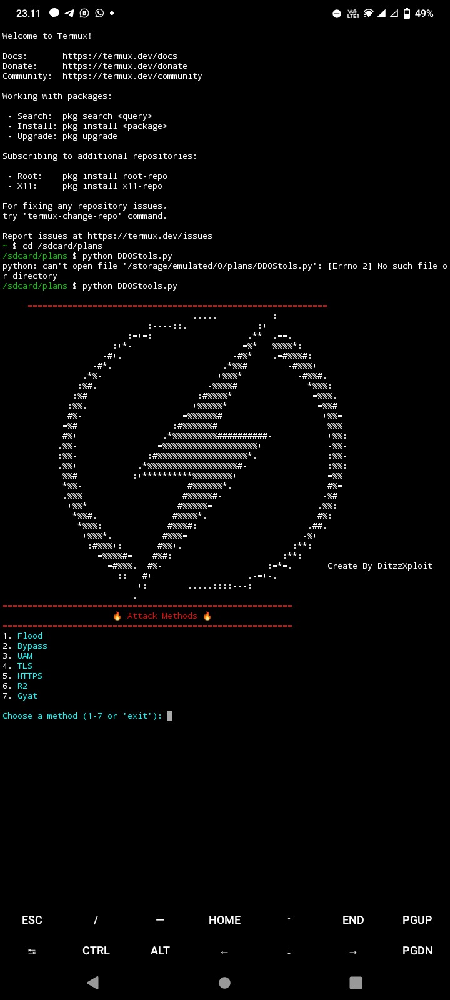

<h1>how to use ?</h1>
<marquee bhivor="scroll">DitzzXploit</marquee>

<h2>Command using termux</h2>
pkg update && pkg upgrade
pkg install git
pkg install python
pkg install sh

git clone https://github.com/CamhackByDitzzXploit/plans-ddos/
cd plans-ddos
ls

sh run.sh

password: DitzzXploit

</img>
 
<image src="Screenshot_2025_0224_235447.jpg"></image>
